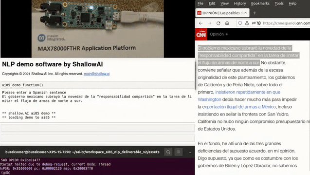

# NanoTranslator by HyperbeeAI
Copyrights © 2023 Hyperbee.AI Inc. All rights reserved. hello@hyperbee.ai

This repository contains the Spanish-to-English translation utility by HyperbeeAI called NanoTranslator. **The model takes up less than 400 KBs of RAM and provides accurate translation for casual conversations.**

To run the demo, see explanations in "demo.ipynb", which acts as the serial terminal to communicate with the ai85 from the host PC. Further explanations are provided below as well as in the notebooks.

### Contents:

- **.py files:** python modules used by the Jupyter notebooks. These files define a simulation environment for the MAX78000 CNN accelerator hardware + some peripheral tools that help evaluation. Note that the simulator only includes the chip features that are relevant to this project (e.g., pooling not implemented because this project does not need it).  

- **evaluation.ipynb:** this Jupyter notebook provides an interface to try out different sentences from the test set on the model in the simulation environment, and compute the BLEU score of the model over the test set.

- **demo.ipynb:** this Jupyter notebook acts as the serial interface with the chip. A sentence in the source language is sent over to the chip for translation via the serial port, the implementation on the chip translates this and sends it back via the same serial port in the target language, and the result is displayed on the notebook cell. This needs to be run together with the "assets/demo.elf" program on the chip, which does the actual translation job on the ai85. There is a specific cell on the notebook that needs to be run before the ai85 demo.elf is started. Check the notebook for further info.

- **assets/demo.elf:** C program running the actual translation application. Run this together with the demo.ipynb notebook for the translation demo. See further explanations inside demo.ipynb.

### Extras/Notes:

- the demo C program does not require any extra modules/libraries, it can be directly run the same way as the Maxim SDK examples (i.e., using the arm gdb, defining the target as "remote localhost:3333", doing "load" etc.). However, note that the Jupyter notebook demo.ipynb needs to be run together with the C program for meaningful output. There is a specific cell on the notebook that needs to be run before the ai85 demo.elf is started. Check the notebook for further info.

- The demo.ipynb notebook needs to run on the same host PC that programs the ai85 since it uses the on-board (USB) serial port (that programs the ai85) to communicate with the chip while the translation application is running.

- Although the program should run on both the EVKit and the FeatherBoard without errors (since it uses common functionality), it was only explicitly tested with the FeatherBoard for now.

### Setup:

This demo has been tested with the following configuration: 

    Python              3.8.10.
    datasets            1.8.0    
    huggingface-hub     0.0.10   
    ipykernel           5.5.3    
    ipython             7.22.0   
    notebook            6.3.0    
    numpy               1.20.2   
    pyserial            3.5      
    sacrebleu           1.5.1    
    tokenizers          0.10.3   
    torch               1.8.1    
    torchtext           0.9.1    
    tqdm                4.49.0

Note1: torchtext might default to older versions (e.g., v0.8) on some containers (typically in those provided by AWS, which use older versions of python that don't align well with the newer torchtext versions), in that case, the .legacy submodule path needs to be removed from the import directives in the .py files and Jupyter notebooks.

Note2: there are multiple python packages on pip that provide serial port implementation, with conflicting function/object names too. Although the package used here gets imported with "import serial", it needs to be installed via "pip install pyserial", not "pip install serial". Make sure you get the correct version.
